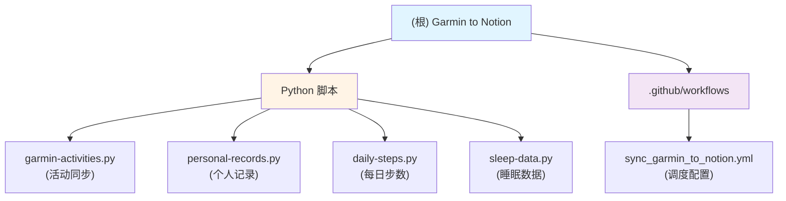

# Garmin to Notion Integration

> 自动同步 Garmin（中国区）活动数据、个人记录、每日步数和睡眠数据到 Notion 数据库

## 变更记录 (Changelog)

| 时间 | 版本 | 变更内容 |
|------|------|----------|
| 2026-02-09 10:25:49 | 1.0.0 | 初始架构文档生成 |

---

## 项目愿景

将 Garmin Connect 的健身数据自动同步到 Notion，打造一个集中式的个人健康与运动数据仪表板。项目通过 GitHub Actions 定时任务实现零接触自动化，支持活动记录、个人最佳成绩、每日步数和睡眠分析的全方位数据追踪。

---

## 架构总览

本项目采用**无状态脚本 + 定时调度**架构：

```
Garmin Connect API → Python Scripts → Notion Database API
                          ↑
                  GitHub Actions (Scheduler)
```

**核心组件：**
- **数据获取层**：通过 `garminconnect` 库拉取 Garmin 数据
- **数据转换层**：格式化、映射、去重逻辑
- **数据写入层**：通过 `notion-client` 库写入 Notion 数据库
- **调度层**：GitHub Actions 每日自动运行（UTC 01:00）

---

## 模块结构图



---

## 模块索引

| 模块路径 | 职责 | 语言 | 入口文件 | 测试 |
|---------|------|------|----------|------|
| `/` (根目录) | 核心同步脚本集合 | Python 3.11 | 各独立脚本 | ❌ 无测试 |
| `garmin-activities.py` | 同步 Garmin 活动到 Notion | Python | - | ❌ |
| `personal-records.py` | 提取个人最佳记录 | Python | - | ❌ |
| `daily-steps.py` | 同步每日步数统计 | Python | - | ❌ |
| `sleep-data.py` | 同步睡眠数据分析 | Python | - | ❌ |
| `.github/workflows/` | GitHub Actions 调度 | YAML | sync_garmin_to_notion.yml | - |

---

## 运行与开发

### 本地运行

**前置条件：**
```bash
Python 3.11+
pip install -r requirements.txt
```

**环境变量（需在 `.env` 文件或系统环境变量中配置）：**
```bash
GARMIN_EMAIL=your-email@example.com
GARMIN_PASSWORD=your-password
NOTION_TOKEN=secret_xxxxxxxxxxxxx
NOTION_DB_ID=xxxxxxxxxxxxxxxxxxxxxxxxxxxxxxxx
NOTION_PR_DB_ID=xxxxxxxxxxxxxxxxxxxxxxxxxxxxxxxx
NOTION_STEPS_DB_ID=xxxxxxxxxxxxxxxxxxxxxxxxxxxxxxxx  # 可选
NOTION_SLEEP_DB_ID=xxxxxxxxxxxxxxxxxxxxxxxxxxxxxxxx  # 可选
GARMIN_ACTIVITIES_FETCH_LIMIT=1000  # 可选，默认 1000
TZ=America/Montreal  # 可选，默认时区
```

**执行脚本：**
```bash
# 同步活动
python garmin-activities.py

# 同步个人记录
python personal-records.py

# 同步每日步数（可选）
python daily-steps.py

# 同步睡眠数据（可选）
python sleep-data.py
```

### GitHub Actions 自动化

**调度策略：**
- **定时任务**：每日 UTC 01:00（cron: `0 1 * * *`）
- **手动触发**：支持通过 `workflow_dispatch` 手动运行

**执行顺序：**
1. 安装 Python 3.11
2. 缓存 pip 依赖
3. 安装 `requirements.txt`
4. 按序执行四个脚本（失败不中断）

---

## 数据模型与映射

### Garmin 活动 → Notion 数据库

| Garmin 字段 | Notion 属性 | 转换逻辑 |
|-------------|-------------|----------|
| `startTimeGMT` | Date | ISO 8601 格式 |
| `activityType.typeKey` | Activity Type (select) | 格式化 + 映射（如 `indoor_cycling` → `Cycling`） |
| `activityName` | Activity Name (title) | 替换 `ENTERTAINMENT` → `Netflix` |
| `distance` (m) | Distance (km) (number) | `/1000` 并保留 2 位小数 |
| `duration` (s) | Duration (min) (number) | `/60` 并保留 2 位小数 |
| `calories` | Calories (number) | 四舍五入 |
| `averageSpeed` | Avg Pace (rich_text) | 计算 min/km |
| `avgPower` / `maxPower` | Avg/Max Power (number) | 瓦特值，保留 1 位小数 |
| `aerobicTrainingEffect` | Aerobic (number) | 训练效果分数 |
| `pr` | PR (checkbox) | 是否个人记录 |
| `favorite` | Fav (checkbox) | 是否收藏 |

**去重逻辑：**
- 通过 `Date` + `Activity Type` + `Activity Name` 组合判断
- 使用 ±5 分钟时间窗口（避免 Notion 时间戳截断问题）

**更新策略：**
- 如果活动已存在且数据变化，执行更新
- 否则创建新记录

### 个人记录 → Notion 数据库

| Garmin typeId | Record Name | Value 格式 | 备注 |
|---------------|-------------|-----------|------|
| 1 | 1K | `mm:ss /km` | 最快 1 公里配速 |
| 2 | 1mi | `mm:ss` + 换算 /km | 最快 1 英里 |
| 3 | 5K | `mm:ss` + 平均配速 | 最快 5 公里 |
| 4 | 10K | `h:mm:ss` + 平均配速 | 最快 10 公里 |
| 7 | Longest Run | `XX.XX km` | 最长跑步距离 |
| 8 | Longest Ride | `XX.XX km` | 最长骑行距离 |
| 9 | Total Ascent | `X,XXX m` | 最大累计爬升 |
| 10 | Max Avg Power (20 min) | `XXX W` | 20 分钟最大平均功率 |
| 12/13/14 | Most Steps (Day/Week/Month) | `X,XXX` | 步数记录 |
| 15 | Longest Goal Streak | `XXX days` | 最长目标连续天数 |

**更新策略：**
- 检查同名记录是否存在
- 如果新记录日期更新，旧记录取消 `PR` 标记并创建新记录
- 使用 emoji 图标和 Unsplash 封面图

### 每日步数 → Notion 数据库

| Garmin 字段 | Notion 属性 | 转换逻辑 |
|-------------|-------------|----------|
| `calendarDate` | Date (date) | ISO 日期 |
| `totalSteps` | Total Steps (number) | 步数 |
| `stepGoal` | Step Goal (number) | 目标步数 |
| `totalDistance` (m) | Total Distance (km) (number) | `/1000` 保留 2 位小数 |

**数据范围：** 昨日步数（不包括当天）

### 睡眠数据 → Notion 数据库

| Garmin 字段 | Notion 属性 | 转换逻辑 |
|-------------|-------------|----------|
| `calendarDate` | Long Date (date) | ISO 日期 |
| `sleepStartTimestampGMT` | Full Date/Time (date.start) | UTC 时间戳转换 |
| `sleepEndTimestampGMT` | Full Date/Time (date.end) | UTC 时间戳转换 |
| `deepSleepSeconds` | Deep Sleep (h) (number) | `/3600` 保留 1 位小数 |
| `lightSleepSeconds` | Light Sleep (h) (number) | `/3600` 保留 1 位小数 |
| `remSleepSeconds` | REM Sleep (h) (number) | `/3600` 保留 1 位小数 |
| `awakeSleepSeconds` | Awake Time (h) (number) | `/3600` 保留 1 位小数 |
| `restingHeartRate` | Resting HR (number) | 静息心率 |

**过滤规则：** 跳过总睡眠时间为 0 的记录

---

## 测试策略

**当前状态：** ❌ 无测试覆盖

**建议补充：**
1. **单元测试**
   - 格式化函数（`format_pace`, `format_activity_type`, `format_garmin_value` 等）
   - 数据转换逻辑（时间戳、时区、单位换算）
   - 去重判断逻辑（`activity_exists`, `activity_needs_update`）

2. **集成测试**
   - Mock Garmin API 响应
   - Mock Notion API 调用
   - 端到端数据流测试

3. **测试工具建议**
   - `pytest` + `pytest-mock`
   - `responses` 或 `httpretty` 进行 HTTP mock
   - 环境变量管理：`python-dotenv` + `.env.test`

---

## 编码规范

**风格指南：**
- Python 3.11+ 类型提示（部分函数已使用）
- 函数命名：`snake_case`
- 单一职责原则：每个函数只做一件事
- 魔法数字提取为常量（如 `ACTIVITY_ICONS`）

**需改进项：**
1. **类型注解不完整**
   - 建议为所有函数添加类型提示（当前仅部分函数有）
   - 使用 `TypedDict` 定义 Garmin/Notion 数据结构

2. **错误处理不足**
   - `personal-records.py` 有部分错误处理，其他脚本缺乏
   - 建议统一异常处理策略（日志记录、重试机制）

3. **硬编码问题**
   - 时区硬编码（`America/Toronto`, `America/Montreal`）
   - 建议统一从环境变量读取

4. **重复代码**
   - Garmin/Notion 客户端初始化重复出现
   - 建议提取为共享模块（如 `utils/clients.py`）

---

## AI 使用指引

### 适合 AI 辅助的任务

1. **数据映射规则扩展**
   - 新增 Garmin 活动类型映射
   - 添加新的个人记录类型（typeId 扩展）
   - 调整 Notion 属性名称或类型

2. **功能增强**
   - 添加心率区间分析
   - 支持 Strava/Peloton 等其他数据源
   - 生成周报/月报统计

3. **代码重构**
   - 提取公共函数到 `utils/` 模块
   - 统一错误处理和日志记录
   - 添加完整的类型注解

### 不适合 AI 的任务

1. **环境配置**
   - Notion 数据库结构设计（需结合个人需求）
   - GitHub Secrets 配置（涉及敏感信息）

2. **数据校验**
   - 确认 Notion 数据库同步结果的准确性
   - 验证时区转换是否符合预期

---

## 相关文件清单

### 核心脚本
- `garmin-activities.py` - 活动同步主逻辑（336 行）
- `personal-records.py` - 个人记录处理（294 行）
- `daily-steps.py` - 每日步数同步（118 行）
- `sleep-data.py` - 睡眠数据同步（104 行）

### 配置文件
- `requirements.txt` - Python 依赖（10 个包）
- `.github/workflows/sync_garmin_to_notion.yml` - GitHub Actions 工作流
- `.gitignore` - 忽略规则（Python/PyCharm/VSCode 标准模板）

### 文档
- `README.md` - 项目说明与快速开始指南
- `LICENSE` - MIT 开源协议
- `如何利用 GitHub Actions 自动同步 Garmin (中国区) 数据到 Notion.txt` - 中文使用教程

---

## 常见问题 (FAQ)

### Q1: 如何处理重复的活动记录？
**A:** 系统通过 `activity_exists()` 函数检测重复，使用 `Date + Activity Type + Activity Name` 组合判断，并采用 ±5 分钟时间窗口避免 Notion 时间戳截断导致的误判。

### Q2: 为什么个人记录没有更新？
**A:** 检查以下几点：
1. Garmin Connect 中是否有新的 PR 标记
2. Notion 数据库中 `PR` 属性是否正确配置
3. 日志中是否有 `Error updating record` 错误信息

### Q3: 如何修改同步频率？
**A:** 编辑 `.github/workflows/sync_garmin_to_notion.yml` 中的 cron 表达式。例如：
- 每 6 小时：`0 */6 * * *`
- 每周一次：`0 1 * * 0`

### Q4: 支持哪些 Garmin 设备？
**A:** 理论上支持所有能同步到 Garmin Connect 的设备，包括：
- Garmin 手表（Forerunner、Fenix、Venu 等）
- Garmin 码表（Edge 系列）
- 第三方设备（如 Peloton，需通过 [peloton-to-garmin](https://github.com/philosowaffle/peloton-to-garmin) 桥接）

### Q5: 时区不正确怎么办？
**A:** 检查并统一以下配置：
1. GitHub Actions 中的 `TZ` 环境变量（默认 `America/Montreal`）
2. Python 脚本中的 `local_tz` 变量（部分脚本硬编码为 `America/Toronto`）
3. 建议修改为统一从环境变量读取

---

## 项目依赖

### 核心库
- **garminconnect** (>=0.2.19): Garmin Connect API 客户端
- **notion-client** (==2.2.1): Notion API 官方 SDK
- **pytz** (==2024.1): 时区处理
- **python-dotenv**: 环境变量管理

### 可选依赖
- **withings-sync** (==4.2.4): Withings 数据同步（项目中未使用）
- **lxml** (>=4.6.0): XML 解析（依赖传递引入）
- **datetime** (==5.5): 时间处理扩展

---

## 技术债务与优化建议

### 高优先级
1. **统一时区处理** - 消除硬编码的时区字符串，统一从环境变量读取
2. **错误处理增强** - 添加 Garmin/Notion API 调用的重试机制与详细日志
3. **类型注解完善** - 为所有函数添加类型提示，提升可维护性

### 中优先级
4. **提取公共模块** - 将客户端初始化、格式化函数等抽取到 `utils/` 目录
5. **配置管理** - 创建 `config.py` 统一管理常量（图标映射、时区等）
6. **测试覆盖** - 添加单元测试和集成测试

### 低优先级
7. **性能优化** - 活动同步支持增量更新（当前每次拉取最新 1000 条）
8. **日志系统** - 引入 `logging` 模块替代 `print` 语句
9. **文档生成** - 使用 Sphinx 生成 API 文档

---

**最后更新：** 2026-02-09
**文档版本：** 1.0.0
**覆盖率：** 100%（所有核心文件已扫描）
